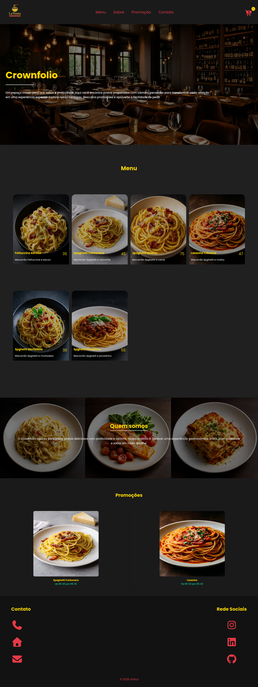

# 🍴 Crownfolio

> Um site funcional para simular a experiência de um restaurante com sistema de delivery online.

🔗 [Acesse o site](https://arthurscdev.github.io/crownfolio/)

[](#)
[](#)
[](#)
[](#)

---

## 📌 Sobre o Projeto

O **Crownfolio** é uma aplicação web interativa desenvolvida com o objetivo de simular o fluxo de atendimento e cardápio de um restaurante moderno com delivery.

A ideia principal do projeto foi consolidar conhecimentos em **React**, manipular estado para o carrinho de compras e explorar a integração do desenvolvimento com auxílio de Inteligência Artificial para refatoração e otimização de código.



---

## ✨ Funcionalidades

- 🏠 **Apresentação:** Hero section responsiva para recepção do usuário.
- 🍕 **Menu Interativo:** Catálogo de pratos integrado diretamente ao carrinho.
- 🛒 **Carrinho de Compras:** Adição, visualização e gestão de itens e totais do pedido.
- 📖 **Sobre Nós:** Seção institucional apresentando a proposta do restaurante.
- 🏷️ **Promoções:** Seção dedicada para destaque de ofertas especiais.
- 📞 **Contato & Redes:** Informações de localização, redes sociais e links de atendimento.

---

## 🛠️ Tecnologias Utilizadas

- **React.js** (Componentização e gestão de estado)
- **JavaScript (ES6+)**
- **HTML5 & CSS3** (Layout responsivo e estilização)
- **JSON** (Modelagem e manipulação de dados do menu)

---

## 🧠 Aprendizados e Evolução

Este projeto marcou um ponto importante no meu aprendizado como desenvolvedor Front-end:

- Prática intensa em **componentização e gerenciamento de estado** no React.
- Consolidação de conceitos aprendidos durante meus estudos.
- Uso eficiente de **IA generativa** como ferramenta de co-pilotagem para acelerar a refatoração e resolução de problemas.
- Processo contínuo de refatoração e melhorias visuais/estruturais no código.

---

## 🚀 Como Executar o Projeto Localmente

```bash
# Clorar o repositório
git clone [https://github.com/seu-usuario/crownfolio.git](https://github.com/seu-usuario/crownfolio.git)

# Entrar na pasta do projeto
cd crownfolio

# Instalar as dependências
npm install

# Iniciar o servidor de desenvolvimento
npm start
```

---

## 📬 Contato

Gosta do projeto ou tem alguma sugestão de melhoria? Fique à vontade para entrar em contato ou dar um star ⭐ no repositório!

💻 [**LinkedIn**](https://www.linkedin.com/in/arthur-sc/)

📷 [**Instagram**](https://www.instagram.com/arthurscdev/)

📄 [**Currículo**](https://drive.google.com/file/d/1KWIg4bjw-WJLmqDow7XGlTTGh58OEewE/view)

---
